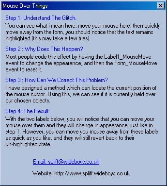



## Highlight On Mouse Over \- No Glitches

### Description

Have you ever created a link for your email or homepage, which uses an object that highlights when you move your mouse over it? This is a much more efficient method of doing this, because it will always show the correct state. The reason for this is that most of you have coded it so the Label_MouseMove event highlights and the Form_MouseMove event un-highlights. This is a terrible way of doing it because it's possible to move your mouse away from the label without placing your mouse over the form. Therefore, the label stays highlighted, which is not the desired effect.  See the screen shot for more information.
 
### More Info
 

             |
---                |---
**Submitted On**   |2002-02-06 06:16:20
**By**             |[Nick Spliff](https://github.com/Planet-Source-Code/PSCIndex/blob/master/ByAuthor/nick-spliff.md)
**Level**          |Intermediate
**User Rating**    |3.0 (18 globes from 6 users)
**Compatibility**  |VB 6\.0
**Category**       |[Object Oriented Programming \(OOP\)](https://github.com/Planet-Source-Code/PSCIndex/blob/master/ByCategory/object-oriented-programming-oop__1-47.md)
**World**          |[Visual Basic](https://github.com/Planet-Source-Code/PSCIndex/blob/master/ByWorld/visual-basic.md)
**Archive File**   |[Highlight\_53362262002\.zip](https://github.com/Planet-Source-Code/nick-spliff-highlight-on-mouse-over-no-glitches__1-31527/archive/master.zip)

